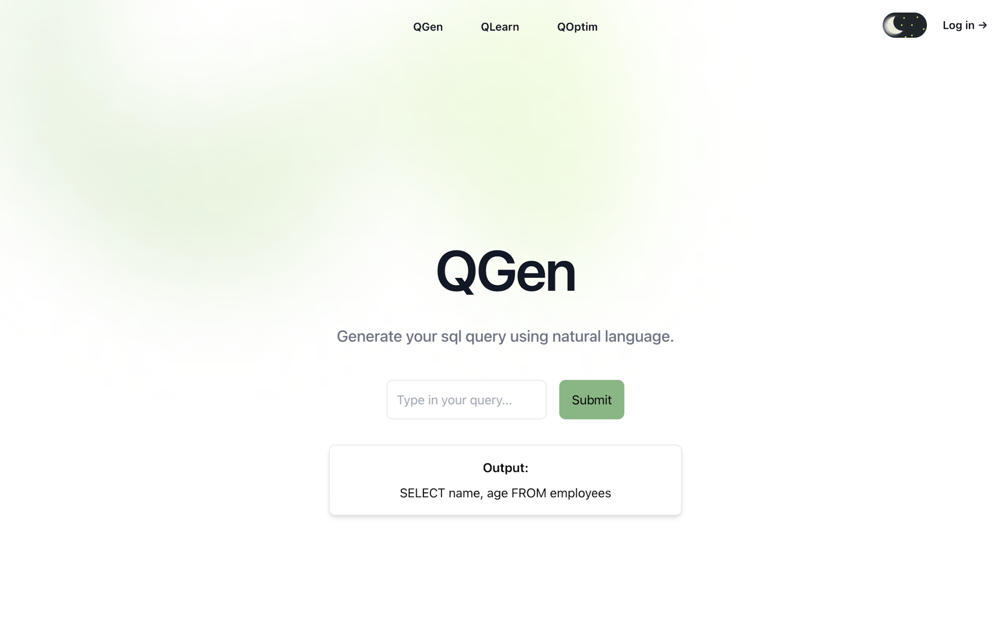

# QGen – SQL Generator
## Project Preview  

  


QGen is a Text-to-SQL Generator that allows users to input a natural language query (English sentence) and automatically generates the corresponding SQL query.

The project fine-tunes a T5 model in two stages:

WikiSQL → Learn general SQL syntax (~60k samples)

Spider → Learn schema-aware SQL generation (~7k samples)

The trained model is integrated into a web interface for easy usage.

# Features

Convert English queries → SQL queries

Two-stage fine-tuned T5 model with LoRA adapters

Schema-aware query generation

FastAPI backend with REST API endpoint

React frontend for interactive usage

Modular repo: ML training, backend, and frontend separated.

# Tech Stack

Model: T5-small (fine-tuned with LoRA)

Datasets: WikiSQL (~60k) & Spider (~7k preprocessed)

Frameworks:

Hugging Face Transformers

PEFT (LoRA adapters)

PyTorch

Backend: FastAPI + Uvicorn

Frontend: React

# Project Structure
```bash
sql/
│── ML/                       # Model training & fine-tuning
│   ├── adapter_checkpoint/    # Fine-tuned model weights (LoRA adapters)
│   ├── data/                  # Dataset instructions & CSVs
│   │   └── readme.md          # Dataset download links (WikiSQL & Spider)
│   ├── notebooks/             # Jupyter notebooks for training & experiments
│   └── test.py                # Model testing script
│
│── client/                    # Frontend (React app)
│── server/                    # Backend (FastAPI server)
│   └── test.py                # Core server code
│
│── requirements.txt           # Python dependencies
│── README.md                  # Documentation
│── .gitignore

```

# Datasets

This project uses two major datasets:

1. WikiSQL (~60k samples)

Pairs of natural language questions ↔ SQL queries

Goal: teach the model SQL syntax basics

2. Spider (~7k samples, preprocessed)

Pairs of natural language questions + DB schema ↔ SQL queries

Goal: train the model to handle schema-aware queries
# Running Locally
```
git clone https://github.com/Zoheen0610/sql.git
cd sql
pip install -r requirements.txt
cd server
uvicorn server.test:app --reload
cd client
npm install
npm start


